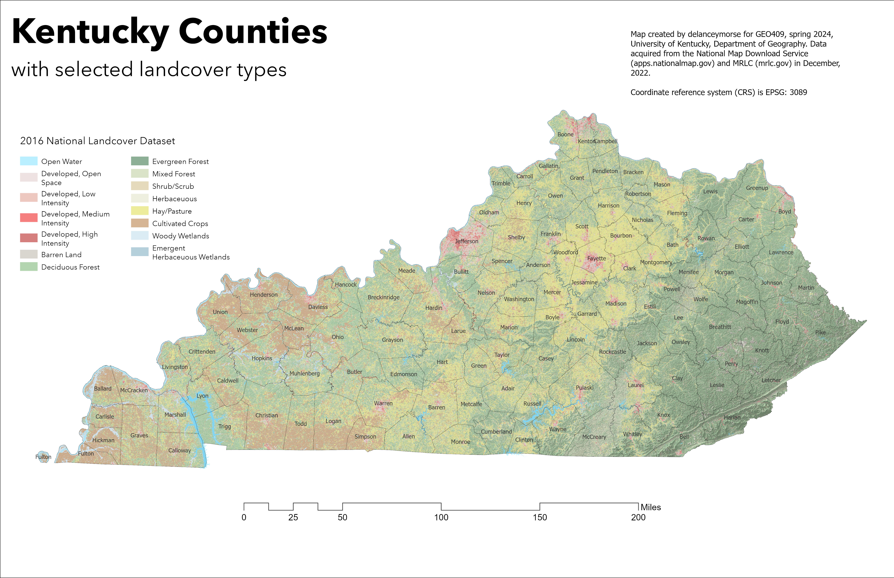
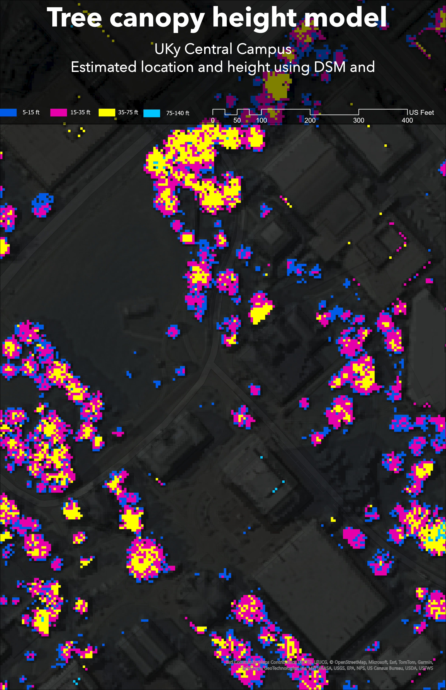

# GEO409 Field Trip Maps

Maps for field trip to measure tree canopy

 

 Kentucky counties with selected landcover types - [Download geospatial PDF](./Ky_Counties.pdf)

UKy central campus canpopy model - [Download geospatial PDF](./Tree_Height.pdf)

Maps created by delanceymorse for GEO409, Spring 2024, University of Kentucky Department of Geography
